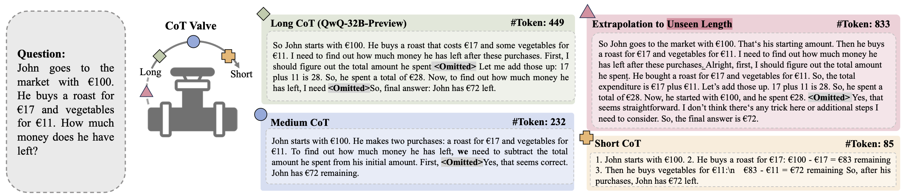

<h1>CoT-Valve: Length-Compressible Chain-of-Thought Tuning</h1>
  

<h3><h3>

  </img>
   
  <em>
      The reasoning model, after the length-compressible CoT tuning, can generate reasoning paths from long to short, leveraging LoRA as a `Valve'.
  </em>

 

> [Xinyin Ma](https://horseee.github.io/)\*, [Guangnian Wan](https://github.com/bigglesworthnotacat)\*, [Runpeng Yu](https://yu-rp.github.io), [Gongfan Fang](https://fangggf.github.io/), [Xinchao Wang](https://sites.google.com/site/sitexinchaowang/)   
> [Learning and Vision Lab](http://lv-nus.org/), National University of Singapore  
> 🥯[[Arxiv]](https://arxiv.org/abs/)  🎄[[Dataset]](https://huggingface.co/collections/horseee/cot-valve-67ae3d0b2f6bddd288504839)   🤖[[Models]]() (coming soon)   
> \* Equal Contribution

### Introduction
We propose a new tuning and inference strategy named CoT-Valve, designed to allow models to generate reasoning chains of varying lengths. 
* We propose to identify a direction in the parameter space that, when manipulated, can effectively control the length of generated CoT. 
* We construct datasets with chains from long to short for the same questions and explore two enhanced strategies for CoT-Valve: (1) a precise length-compressible CoT tuning method, and (2) a progressive chain length compression approach. 
* CoT-Valve successfully enables controllability and compressibility of the chain and shows better performance than the prompt-based control. 
* We applied this method to QwQ-32B-Preview, reducing reasoning chains on GSM8K from 741 to 225 tokens with a minor performance drop (95.07% to 94.92%) and on AIME from 6827 to 4629 tokens, with only one additional incorrect answer.

### TODO
- [x] Release the dataset
- [ ] Release the model
- [ ] Release the trainng code

### 🤗Datasets

We release the following datasets on [Huggingface](https://huggingface.co/collections/horseee/cot-valve-67ae3d0b2f6bddd288504839): 

| Dataset Name | Link | Description |
| --- | ---- | ---- |
| MixChain-Z-GSM8K | [Link](https://huggingface.co/datasets/horseee/MixChain-Z-GSM8K) | MixChain-Z-GSM8K is a dataset containing 6,863 samples, with each sample containing five different solutions.|
| MixChain-Z-PRM12K | [Link](https://huggingface.co/datasets/horseee/MixChain-Z-PRM12K)| MixChain-Z-PRM12K is a dataset containing 12,000 samples (unfiltered), with each sample containing five different solutions |

### Training Code
To be released

### Models
To be released

